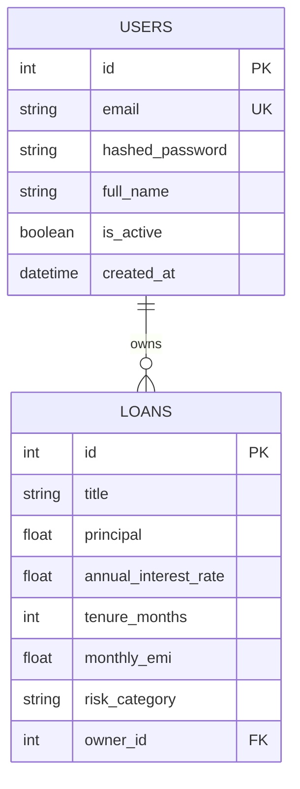

# 🏦 RepayMaster AI — Enterprise Loan Intelligence Platform

RepayMaster AI is a full-stack, enterprise-grade Fintech SaaS product that solves complex loan repayment challenges for both customers and banks using AI-powered insights, predictive modeling, and clean architecture.

## 🌟 Business Problem

**Customers struggle with:**
- Choosing the right loan tenure and bank.
- Understanding the true cost of early repayments.
- Finding optimal strategies when interest rates change.
- Navigating complex financial jargon.

**Banks struggle with:**
- Predicting loan defaults and managing risk.
- Educating customers at scale.
- Recommending optimal loan products programmatically.

**Our Solution:**
RepayMaster AI solves this by offering a robust dashboard that calculates EMIs, visualizes repayment schedules, assesses financial health using a RandomForest risk model, and provides personalized strategies via a Gemini-powered **AI Financial Advisor**.

---

## 🏗 Architecture

The platform is built using a modern **Clean Architecture** pattern to ensure scalability, maintainability, and enterprise readiness.

### High-Level Flow
1. **Client Layer:** React + Vite + TailwindCSS for a highly responsive, dynamic UI.
2. **API Layer:** FastAPI exposing RESTful endpoints, secured by JWT Authentication.
3. **Service Layer:** Core business logic for EMI calculations, Risk predictions (`risk_model.pkl`), and AI Advisory (`google-genai`).
4. **Data Layer:** PostgreSQL powered by SQLAlchemy ORM.

### Tech Stack
- **Frontend:** React, Vite, TailwindCSS, Recharts, Lucide-React
- **Backend:** Python 3.10, FastAPI, Pydantic, Passlib, JWT
- **Database:** PostgreSQL, SQLAlchemy, Alembic
- **Machine Learning & AI:** Scikit-Learn, Google Gemini (Flash 2.5)
- **DevOps:** Docker, Docker Compose, GitHub Actions (CI/CD), Pytest

---

## 🗄 Entity-Relationship (ER) Diagram



---

## 🚀 Features

- **JWT Authentication:** Secure User Signup, Login, and protected routes.
- **AI Financial Advisor:** Gemini-powered conversational AI for loan planning and what-if analysis.
- **Machine Learning Risk Prediction:** Scikit-Learn RandomForest model predicting default risk (Low/Medium/High).
- **Interactive Dashboards:** Recharts visualization for EMI forecasting and loan portfolios.
- **Clean Architecture:** Well-structured backend separating API routes, services, CRUD, and models.
- **Containerization:** Fully Dockerized architecture via `docker-compose`.
- **CI/CD Pipeline:** Automated GitHub actions for linting and running Pytest test suites.

---

## 📂 Folder Structure

```text
RepayMaster/
├── backend/
│   ├── app/                  # DDD Source Code
│   │   ├── main.py
│   │   ├── core/             # Auth, Config, Deps
│   │   ├── db/               # Postgres Config
│   │   └── modules/          # Feature Domains
│   │       ├── ai/
│   │       ├── loans/        
│   │       ├── reports/      
│   │       └── users/
│   ├── requirements.txt
│   └── Dockerfile
├── frontend/
│   ├── src/
│   │   ├── components/       # Reusable UI Blocks (Layout, Loans, Charts)
│   │   ├── pages/            # Login, Dashboard Container
│   │   ├── services/         # API Layer
│   │   ├── App.jsx
│   │   └── main.jsx
│   ├── package.json
│   ├── tailwind.config.js
│   └── Dockerfile
├── docker-compose.yml
├── .github/workflows/ci.yml
└── README.md
```

---

## 📚 API Documentation

FastAPI provides automatic, interactive documentation. Once the app is running, visit:
- **Swagger UI:** `http://localhost:8000/docs`
- **ReDoc:** `http://localhost:8000/redoc`

**Key Endpoints:**
- `POST /api/v1/auth/signup`: Create a new user account.
- `POST /api/v1/auth/login`: Authenticate and receive a JWT.
- `GET /api/v1/auth/me`: Get current user details.
- `GET /api/v1/loans/`: Fetch all loans for the authenticated user.
- `POST /api/v1/loans/`: Create a new loan (auto-calculates EMI & Risk).
- `POST /api/v1/ai/chat`: Send a message to the AI Financial Advisor.

---

## 🛳 Deployment

### Run Locally with Docker
```bash
git clone https://github.com/your-username/RepayMaster.git
cd RepayMaster

# Start PostgreSQL, Backend, and Frontend
docker-compose up --build
```
- **Frontend:** http://localhost:4173
- **Backend:** http://localhost:8000
- **Database:** localhost:5432

### Cloud Deployment (Render / AWS / Azure)
1. Provision a managed **PostgreSQL** database.
2. Deploy the `backend` Dockerfile as a Web Service. Set environment variables (`DATABASE_URL`, `GEMINI_API_KEY`).
3. Deploy the `frontend` Dockerfile as a Static Site or Node service. Update the `VITE_API_URL` to point to the backend domain.

---

## 🔮 Future Scope
- Real-time live bank interest rate API integrations.
- Scheduled email reminders for upcoming EMI payments (Celery/Redis).
- Export complete amortization schedules to PDF reports.
- Advanced AI What-If Simulators directly integrated into charts.

---
**Developed for Enterprise scale. Built to win.**
